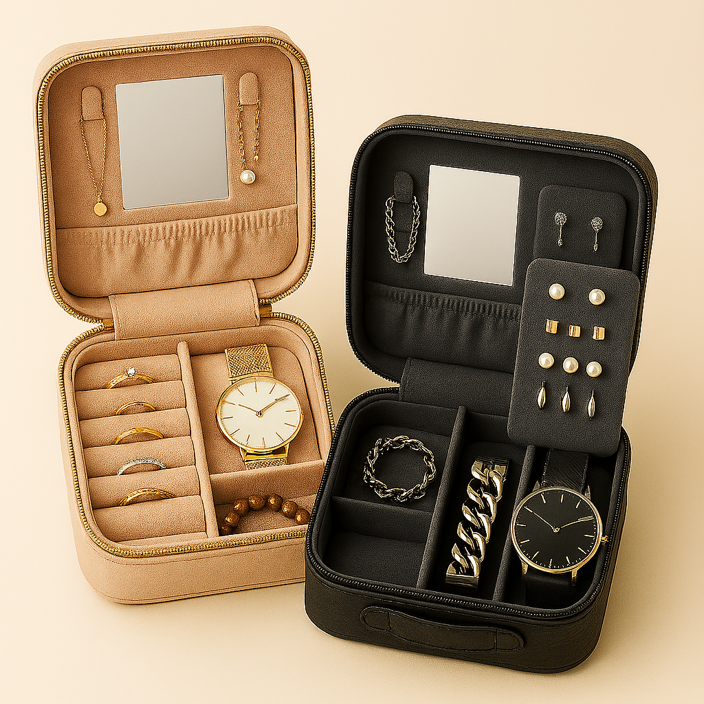

**Introducing Split & Shine: Experience accessorizing like you never have before!**

Split & Shine is not just a jewelry box...it's a shared experience. Crafted for couples who celebrate both their unique styles and their shared journey, this modular storage system offers two distinct compartments that can be used separately or joined seamlessly for travel, display, or safekeeping.

Whether you're storing vintage watches, heirloom rings, or everyday earrings, Split & Shine honors your individuality while keeping you connected.

**Sparkling Features**
- Memory Capsule Drawer - A compartment for notes and small surprises, perfect for a spontaneous surprise
- QR-Linked Story Cards: Scan the code to leave a picture and caption showing your partner your newest look
- Travel Mode Toggle: A Switch to compress both compartments for compact travelling
- Eco-Luxe Materials: Ethically-sourced vegan leather with accents made of recycled materials

**Smart Style**
Upload a photo of your outfit, and let Split & Shine’s Smart Style Matching feature do the rest. Using visual cues like color, neckline, and occasion, it recommends the ideal accessories from your jewelry box—so you never second-guess your sparkle. Whether you're dressing for brunch or a black-tie gala, your look gets the finishing touch it deserves.
**Your outfit. Your vibe. Perfectly paired.**

**Reviews From Our Shining Stars**
- 🌟 “Finally, a jewelry box that understands us.” "My partner and I have totally different styles. He’s all bold metals, I’m delicate golds. Split & Shine lets us organize our accessories separately while still feeling connected. The magnetic merge is genius for travel, and the Memory Capsule drawer? We tucked our wedding vows in there. It’s more than storage. It’s part of our story." — Jasmine & Theo, Brooklyn, NY
- 🌟 “The outfit-matching feature is my new obsession.” "I used to spend forever deciding which earrings worked with my outfit. Now I just upload a pic and Split & Shine recommends the perfect combo. It’s like having a stylist in my pocket. Plus, the LED mirror lighting makes getting ready feel like a mini glam session." — Maya R., Atlanta, GA
- 🌟 “Gifted it to my sister. Now I want one too.” "We live together and always borrow each other’s accessories. I got Split & Shine for her birthday, and now we each have our own side but can snap it together when we travel. The eco-luxe materials feel so premium, and the QR story card made the gift super personal. I’m ordering mine next week!" — Devon L., Seattle, WA

**We're a succes nationwide!**

**FAQ's**
- Can it be locked?
    - Yes, each co,partment has it's own separate lock to keep valuable items safe
- Do you offer personalization?
    - Absolutely! You can add colors, additional featues, pictures, writing, or a tailored interior to make this case for your most special things even more special.
- Is this product only for romantic partners?
    - It's for everyone! Siblings, besties, and more!
      
**"Split & Shine - Two Styles. One sanctuary."
Let us help you sparkle!**